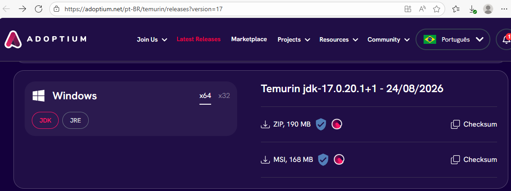
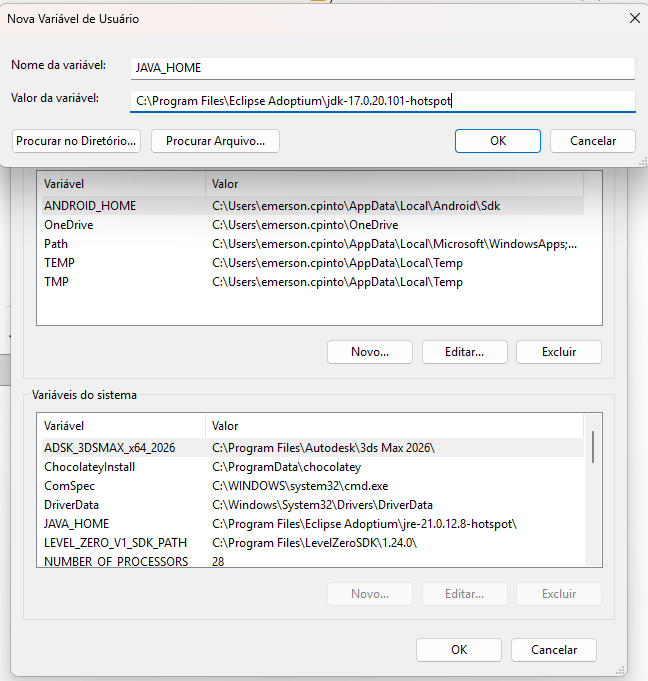
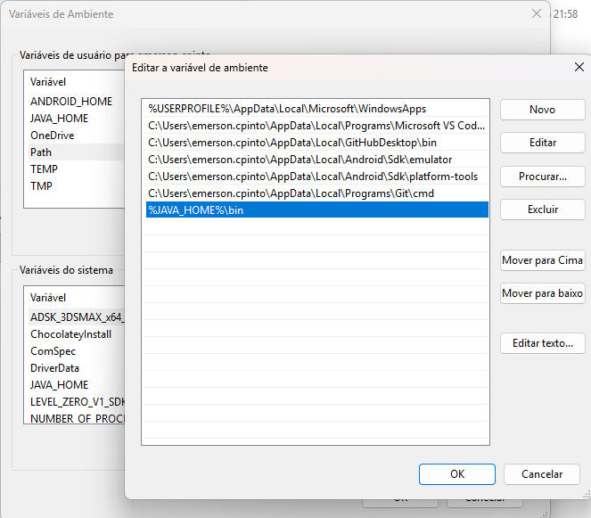
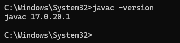

# Iniciando um Projeto

Escolher versão. para escolher uma versão anterior
```sql
npx create-expo-app nome-app --template blank-typescript@sdk-54
```

- Configuração para abrir ele no Android

### Acessar a pasta, e rodar o comando rodar o projeto.
Roda primeiro
```powershell
$env:NODE_TLS_REJECT_UNAUTHORIZED="0"
```
Depois
```powershell
npx expo start
```


# Configuração Inicial para o projeto.

1. Baixar Java no site https://adoptium.net/pt-BR/temurin/releases?version=17

Procurar o Windows Temurin jdk-17.0.20.1+1 - 24/08/2026 
Versão MSI, 168 MB



2. Copiar o caminho

C:\Program Files\Eclipse Adoptium\jdk-17.0.20.101-hotspot

3. Vai na Variavel de ambiente (para sua Máquina)

da um novo coloca nome VAJA_HOME e copia o endereço



4. Depois vai em Path, da um novo e colocar o caminho

%JAVA_HOME%\bin



5. Para analisar se deu certo, abre o cmd e digite.

javac -version



6. Neste caso por causa rede senac, tem que usar nome curto, por isso usando o C: para usar.

Abrir o terminal pelo C:

rodar comando 

```powershell
npx create-expo-app nome-app --template blank-typescript@sdk-54
```


7. Neste caso por causa rede senac, tem que rodar

```powershell
$env:NODE_TLS_REJECT_UNAUTHORIZED="0"

$env:JAVA_TOOL_OPTIONS="-Djavax.net.ssl.trustStoreType=WINDOWS-ROOT -Djavax.net.ssl.trustStore=NONE"
```

8. Tem que instalar, pois ele faz a copilação.
```powershell
npx expo install expo-dev-client
```

9. Comando para poder rodar e gerar a pasta Android
```powershell
npx expo prebuild --clean 
```
Da um Y de Yes.

10. Para fazer instalação do APK, vai rodar o projeto em forma de APK

```powershell
npx expo run:android
```

11. se funcionar o pre build porque está como pra gerar o APK

12. tem que acessar o projeto, acessar a pasta 

cd Android

- depois de acessar digite 

.\gradlew assembleRelease

para pegar o apk, o caminho

android\app\build\outputs\apk\release\app-release.apk